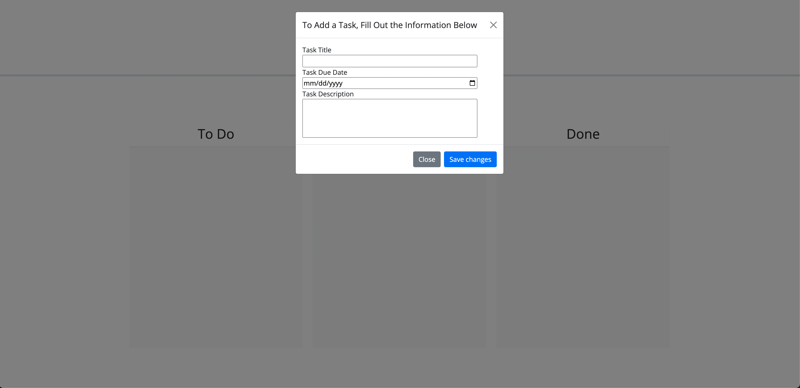
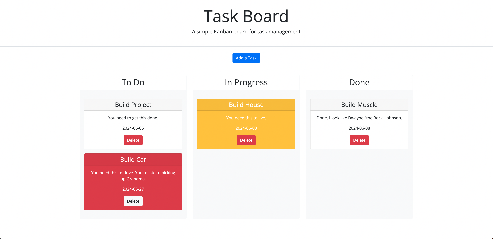

# doppler-module-5-challenge

## Purpose
The purpose of this challenge was to build a Kanban Project Management Board. It featured writing code in HTML, CSS, and Javascript. It's purpose was to utilize Javascript and JQuery to affect the HTML and CSS based on user input conditions. It focused on utilizing JQuery to manipulate the DOM and generate HTML elements. Our CSS was generated using the Bootstrap framework.  The needed functionality included a rendering task cards that had drag and drop functionality. Our CSS styling for a task card was affected based on date utilizing the DayJS package.

## Description
This Kanban Board allows users to generate project cards containing a title, description and due date. IT included local storage of cards. It also had the ability to drag and drop the project cards into different swim lanes and updated their status property in the Local Storage upon dropping the card into the appropriate lane. It also is dynamic in that the project card will change colors dependent upon the proximity to the due day. If the project is at risk, it will turn yellow. It will turn red if it is past due.

## Usage
To run this project, please run the source code on a local host or host it on the internet. To see current state of the project, please visit: [https://ndoppler.github.io/doppler-module-5-challenge/](https://ndoppler.github.io/doppler-module-5-challenge/).

## Code Source

Initial instruction was provided by the University of Minnesota EdX Bootcamp.

Reference on how to write this Read-Me was provided by a [Medium.com Article](https://medium.com/@kc_clintone/the-ultimate-guide-to-writing-a-great-readme-md-for-your-project-3d49c2023357).

Instruction on how to construct a modal was obtained from: [Build a Popup With JavaScript](https://www.youtube.com/watch?v=MBaw_6cPmAw). Additional support on how to generate HTML forms and different form input types was obtained from [HMTL Forms](https://www.w3schools.com/html/html_forms.asp).

Reference on how to embed an image into an .md file was utilized from this [DigitalOcean Article](https://www.digitalocean.com/community/tutorials/markdown-markdown-images).

I also utilized the Xpert Learning Assistant provided by the University of Minnesota EdX Full Stack Bootcamp program.

## Website Images

